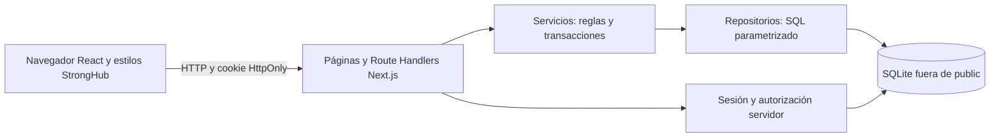
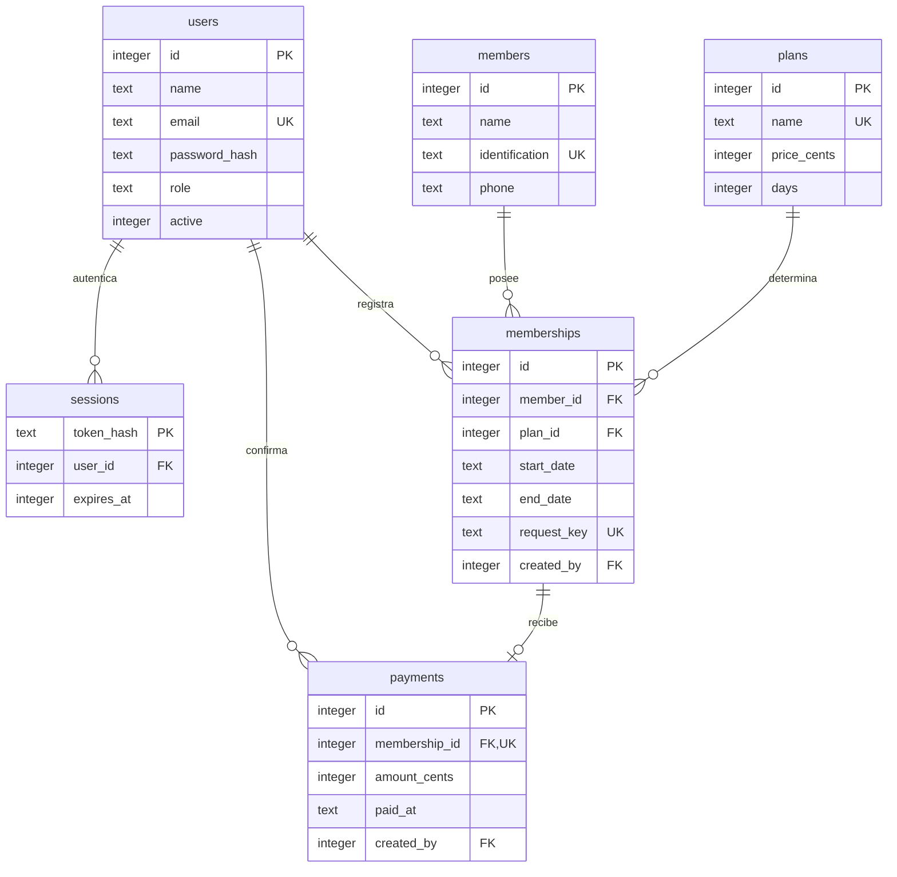
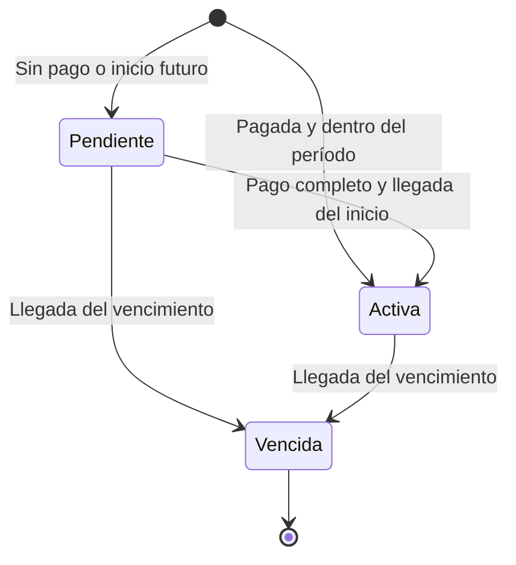

# Documentación académica

Autor individual: **Juan Carlos Núñez**. Diagramas Mermaid editables; no fueron creados en EasyCASE. No se inventan integrantes, reuniones, sprints históricos ni aceptaciones externas.

## Arquitectura



Las páginas servidor consultan datos después de verificar sesión. Los formularios cliente llaman a la API. Es una aplicación con capas lógicas, sin microservicios.

## Modelo de datos



Pago y miembro se asocian mediante membresía. No se duplica esa referencia. La unicidad de membership_id impide pagos duplicados. request_key impide duplicar la solicitud integrada. Desactivar usuarios conserva sus operaciones históricas.

## Secuencia de membresía y pago

```mermaid
sequenceDiagram
  actor Operador
  participant Form as Formulario
  participant API as Route Handler
  participant Auth as Sesión servidor
  participant Service as Servicio
  participant DB as SQLite
  Operador->>Form: Datos, plan, inicio, pago
  Form->>Form: Validar campos y fecha
  Form->>API: POST memberships con requestKey
  API->>Auth: Verificar sesión y usuario activo
  Auth-->>API: Usuario autorizado
  API->>Service: Crear membresía
  Service->>DB: Consultar precio y duración
  Service->>Service: Validar fecha La Paz y monto
  Service->>DB: BEGIN IMMEDIATE
  Service->>DB: Verificar requestKey; obtener/registrar miembro
  Service->>DB: INSERT membresía y vencimiento
  Service->>DB: INSERT pago con fecha y operador
  alt Éxito
    Service->>DB: COMMIT
    API-->>Form: 201 y ID
    Form->>API: Consultar listado actualizado
    API-->>Form: Estado calculado
    Form-->>Operador: La membresía fue registrada correctamente.
  else Error
    Service->>DB: ROLLBACK
    API-->>Form: 400 o 409
  end
```

## Estados



Los estados se calculan al consultar. Intervalo `[inicio,vencimiento)`: vencimiento es el primer día sin cobertura. Treinta días desde 1 de septiembre vencen 1 de octubre. Un pago futuro permanece pendiente hasta inicio; una membresía impaga también vence. Pagar tarde no extiende el período.

## Trazabilidad

| Requisito | Cypress | Servicios / pruebas puras |
|---|---|---|
| Login correcto/incorrecto y HttpOnly | CP-001 | Hash y verificación |
| Logout y revocación | CP-002 | — |
| Restricción de recepción | CP-003 | — |
| Correo único; crear y editar usuario | CP-004 | Correo duplicado y campos |
| Miembro único; registro y edición | CP-004 | Identificación duplicada |
| Membresía y pago integrado | CP-005 | Registro integrado y duración |
| Persistencia al recargar | CP-005 | Otra conexión SQLite |
| Fecha pasada, cliente y servidor | CP-006 | Fecha pasada e inválida |
| Monto exacto y pago separado | CP-007 | Monto incorrecto / pago separado |
| Pago y solicitud duplicados | CP-007 | Duplicados |
| Desactivar usuario revoca acceso | CP-008 | — |
| Pendiente, activa, vencida | CP-005, CP-007 | Estados y límites |
| Atomicidad | — | Rollback de miembro y membresía |

## Aceptación: Dado, Cuando, Entonces

- Dado un usuario activo, cuando introduce credenciales correctas, entonces accede con sesión servidor; credenciales incorrectas se rechazan.
- Dada una sesión, cuando cierra sesión, entonces el token anterior no autoriza consultas.
- Dada una recepcionista, cuando solicita usuarios por API o página, entonces recibe denegación o redirección.
- Dado un correo/identificación registrado, cuando intenta otro registro igual, entonces se rechaza sin duplicar.
- Dado el plan mensual, cuando registra fecha actual y US$30, entonces miembro, membresía y pago persisten y el estado es activo.
- Dada una fecha pasada, cuando la envía por interfaz o API, entonces recibe el mensaje requerido y no se registra.
- Dada una membresía pendiente, cuando confirma el monto exacto, entonces su estado se recalcula y no admite otro pago.
- Dado un registro guardado, cuando recarga o reinicia con la misma base, entonces permanece. La prueba automatizada abre otra conexión; el reinicio completo se comprueba manualmente.

## Registro y autoevaluación personal

Completar personalmente, sin asumir aprobación externa:

| Fecha/equipo | Caso/comando | Esperado | Observado | Pasó/falló/bloqueado | Evidencia propia | Acción pendiente |
|---|---|---|---|---|---|---|
| Por completar | Por completar | Por completar | Por completar | Por completar | Captura/log propio | Por completar |

Autoevaluación: explicar capas, elección de SQLite, centavos, sesión, roles y transacción; identificar limitación y mejora. Registrar fecha, valoración personal y evidencia. No se incluyen calificaciones inventadas.

## Video: hasta cinco minutos

| Tiempo | Recorrido |
|---|---|
| 0:00–0:30 | Presentarse como Juan Carlos Núñez, autor individual; arquitectura y alcance. |
| 0:30–1:00 | Login incorrecto y correcto; dos roles. |
| 1:00–1:40 | Crear miembro, rechazar duplicado y editar teléfono. |
| 1:40–2:40 | Seleccionar miembro, plan mensual, fecha actual y US$30; mostrar pago y vigencia. |
| 2:40–3:10 | Crear sin pago y confirmar en Pagos; cambio de estado. |
| 3:10–3:40 | Recargar y reiniciar con la misma base; mostrar persistencia. |
| 3:40–4:15 | Crear/desactivar usuario; probar /usuarios como recepcionista. |
| 4:15–5:00 | Resultados reales de pruebas, estados, limitaciones y logout. |

Grabar personalmente con Node compatible. No mostrar .env.local ni contraseñas. No se generó video o evidencia ficticia.
